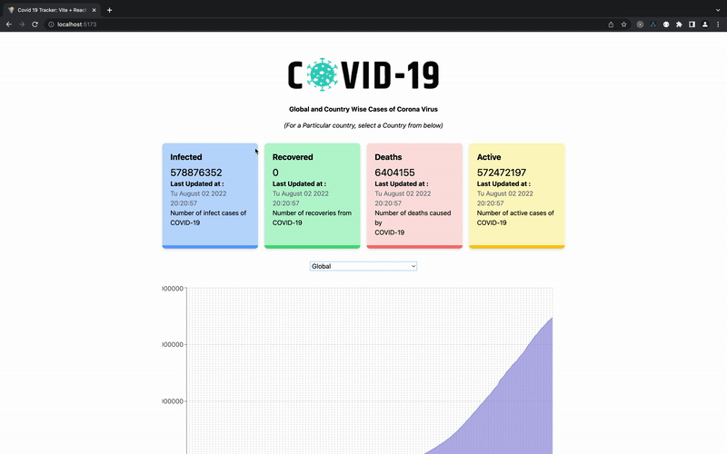

# Covid 19 Tracker App

## Techs:
1. React
2. Vite
3. Type Script
4. Tailwindcss
5. Zustand (For Global State)

## How To Run

Clone the repo

`git clone https://github.com/omer-genc/covid-19-tracker.git`

Install the dependencies

`yarn`

Run the app

`yarn dev`

Screenshot:
